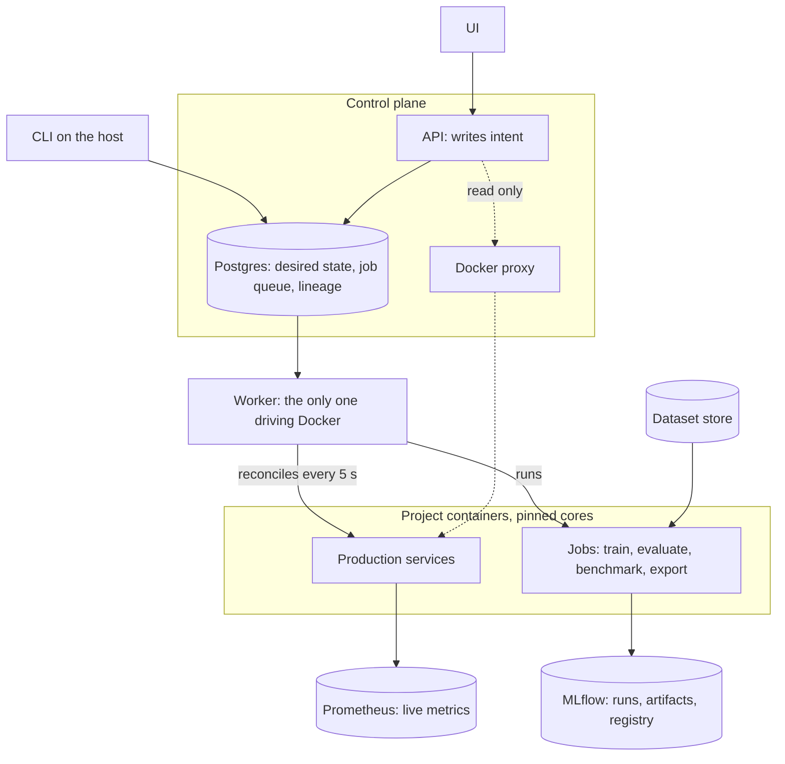
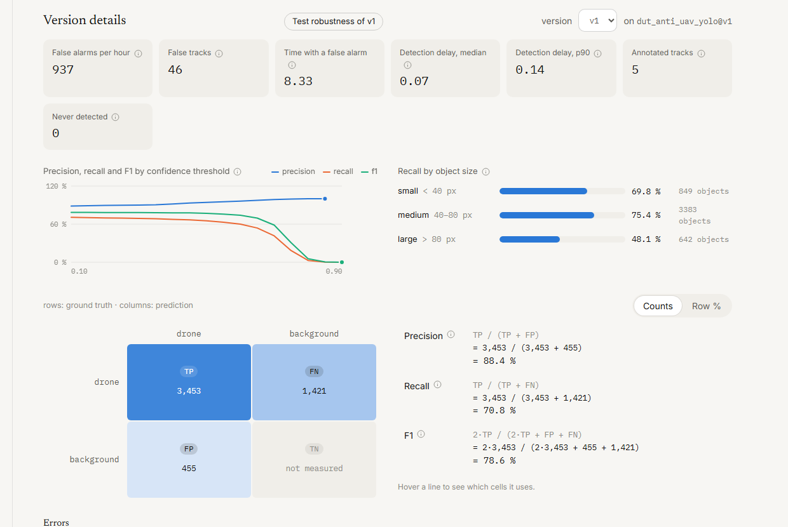
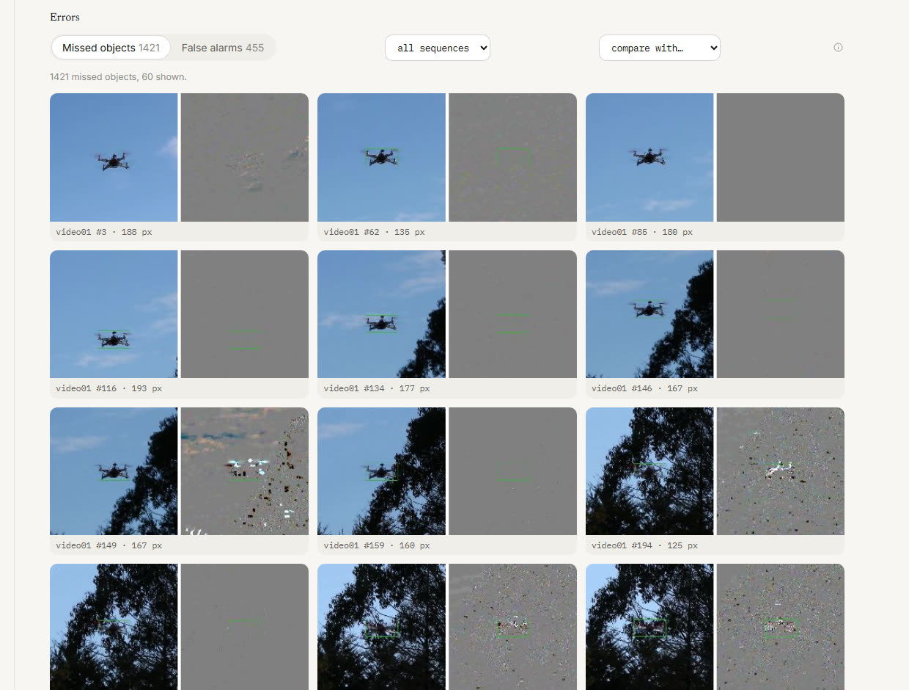
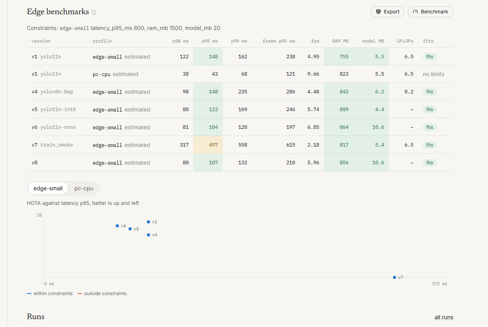
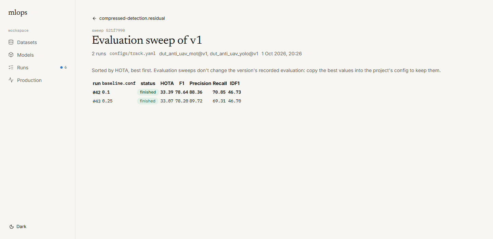

# mlops-platform

Model-agnostic MLOps platform for teams that train and ship their own models, down to edge hardware. A project plugs in with a `project.yaml` ([contract](docs/contract.md)); the platform runs its commands in Docker and reads the JSON they write. It never imports the project's framework. Scope and status: [spec](docs/spec.md).


## What it does

- **Datasets**: immutable versions stored once by content, splits, license, file browser, diff between versions, lineage to every run and model.
- **Training**: queue runs from the UI with config overrides, checked datasets and a hardware profile; live log and curves; automatic evaluation and benchmarks of the new version.
- **Models**: several models per project, variants and exports, comparison on the same dataset version with 95 % intervals, confusion matrix, threshold curves, slices, each metric colored against production.
- **Error analysis**: every missed object and false alarm of an evaluation, thumbnails of the frame and the model input, and what changed between two versions.
- **Sweeps and robustness**: a grid of config values queued as runs and ranked; the same evaluation repeated under the conditions a project declares, for example other video encodings.
- **Reproducibility**: preprocessing files pinned with each version and mounted back for its evaluations and service; Git commit, image id and hardware recorded per run.
- **Promotion**: a rule on the primary metric, guarded metrics and edge constraints per hardware profile; forced promotion with a reason, rollback, history.
- **Edge**: benchmarks on Docker-limited profiles pinned to physical cores, ONNX and INT8 exports as new versions, accuracy against latency.
- **Production**: one container per model, reconciled with its desired state, live latency, throughput, errors and resources against their limits, drift without labels, live view of the frame the model sees.

## Architecture



The API only records intent: jobs to run and the version each service should serve. The worker claims jobs with `SKIP LOCKED`, beats while they run, and reconciles services with their desired state, so a service that dies is put back. A job whose worker stops beating for 90 s is failed and its container removed. Production services and jobs get separate physical cores, so a benchmark never shares a core with a live service.

<details>
<summary>More screenshots</summary>

| Versions colored against production | Version details: operational metrics, curves, confusion matrix |
| --- | --- |
|  |  |

| Errors: frame and residual input around each missed drone | Edge benchmarks against the profile's limits |
| --- | --- |
|  |  |

| Sweep of a tracker threshold | Runs and queue |
| --- | --- |
|  |  |

| Dataset version, splits and lineage | |
| --- | --- |
|  | |

</details>

## Start

```bash
docker compose up -d --build
```

| Service | URL |
| --- | --- |
| Platform UI | http://localhost:8000 |
| API docs | http://localhost:8000/api/docs |
| MLflow | http://localhost:5000 |
| Prometheus | http://localhost:9090 |

Everything runs in Docker. Projects are read from `MLOPS_PROJECTS_DIR` (default: the folder next to this repository), mounted at `/projects`; the platform translates paths to the host's when it mounts them into project containers. Credentials default to `mlops` / `mlops`, override them in `.env`. Services listen on localhost only. After a change to the platform code: `docker compose up -d --build api worker`.

The CLI runs on the host against the same services:

```bash
python -m venv .venv
.venv/Scripts/python -m pip install -e .
mlops dataset list
```

## Plug in a project

A project is a Docker image and a `project.yaml` naming its entrypoints, the datasets it mounts, its metrics and its promotion rule:

```yaml
name: my-detector
image: my-detector:cpu
datasets:
  - { name: drones_yolo, mount: data/yolo }
entrypoints:
  train:    { command: "python train.py --config {config}", config: configs/train.yaml,
              outputs: { model: "models/best.pt", metrics: "results/train.json" } }
  evaluate: { command: "python evaluate.py --model {model}", outputs: { metrics: "results/eval.json" } }
  benchmark: { command: "python bench.py --model {model}", outputs: { metrics: "results/bench.json" } }
metrics: { primary: mAP50, higher_is_better: true }
```

`examples/toy-regression` is a minimal project in plain Python:

```bash
docker build -t mlops-toy-regression:cpu examples/toy-regression
mlops validate examples/toy-regression
mlops dataset add toy data/raw/toy_v1 --license CC0-1.0 --split train=train --split test=test
mlops run examples/toy-regression train --dataset toy@v1
mlops model promote toy-regression 1
mlops serve start toy-regression
```

The full example is `../compressed-detection`, drone detection in the compressed video domain.

## CLI

| Command | Purpose |
| --- | --- |
| `mlops run <project> <entrypoint>` | Run an entrypoint with `--dataset name@vN`, `--model project.model@vN`, `--slot`, `--config`, `--profile`, `--set key=value` |
| `mlops dataset add / list / show / diff / verify` | Dataset versions |
| `mlops model list / import / promote / rollback / history / rename` | Model registry |
| `mlops serve start / stop / status / logs` | Production services |
| `mlops project archive / restore` | Hide a project without deleting anything |

Platform settings are in `configs/platform.yaml` (overridden in Docker by `configs/platform.docker.yaml`), hardware profiles in `configs/hardware_profiles.yaml`. Docker-limited profiles approximate a target and their results are marked estimated.

## Development

```bash
.venv/Scripts/python -m pip install -e ".[dev]"
.venv/Scripts/python -m pytest
cd ui && npm run dev
```

`npm run dev` serves the UI on http://localhost:3000 with `/api` proxied to the API.
