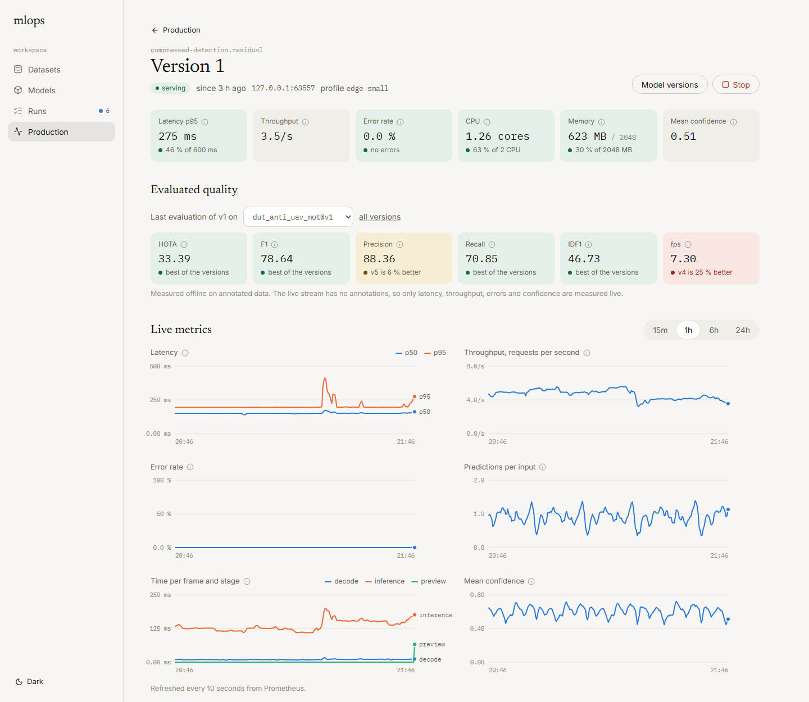
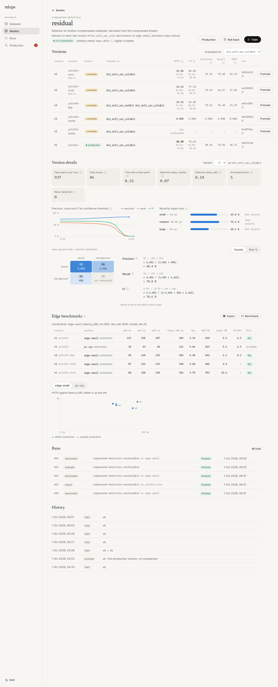
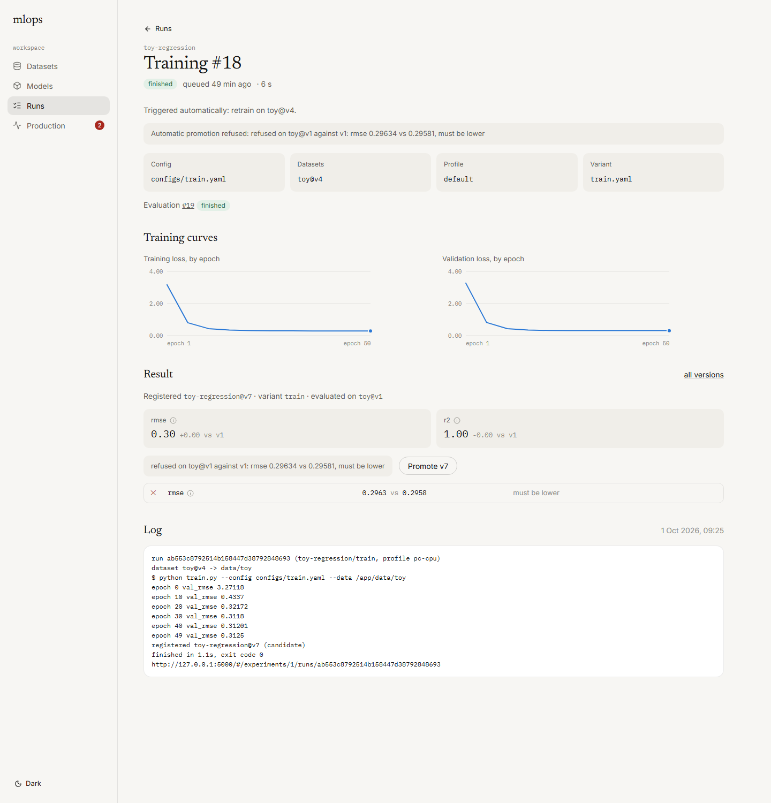
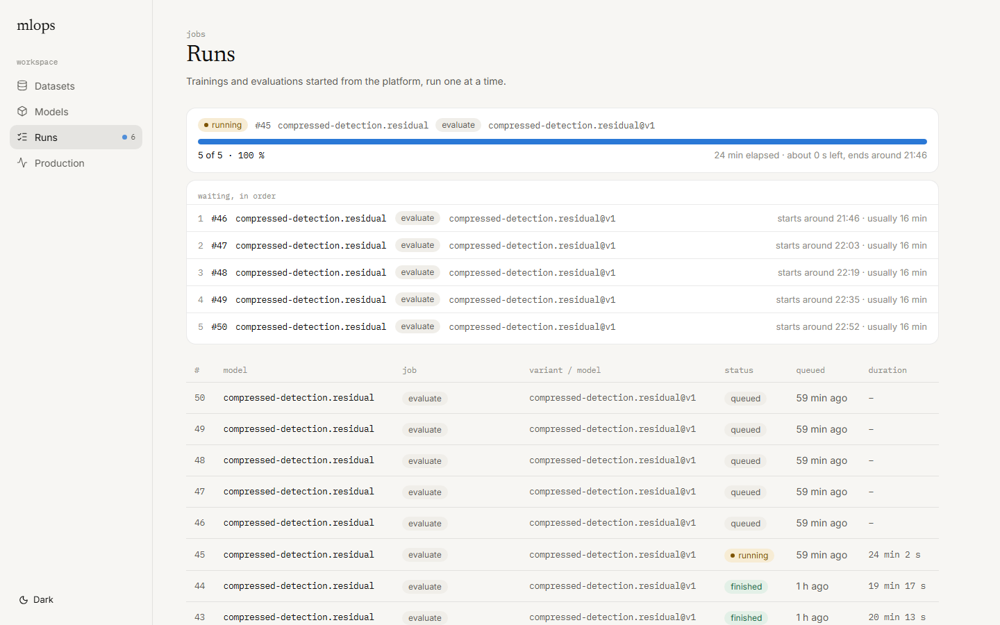
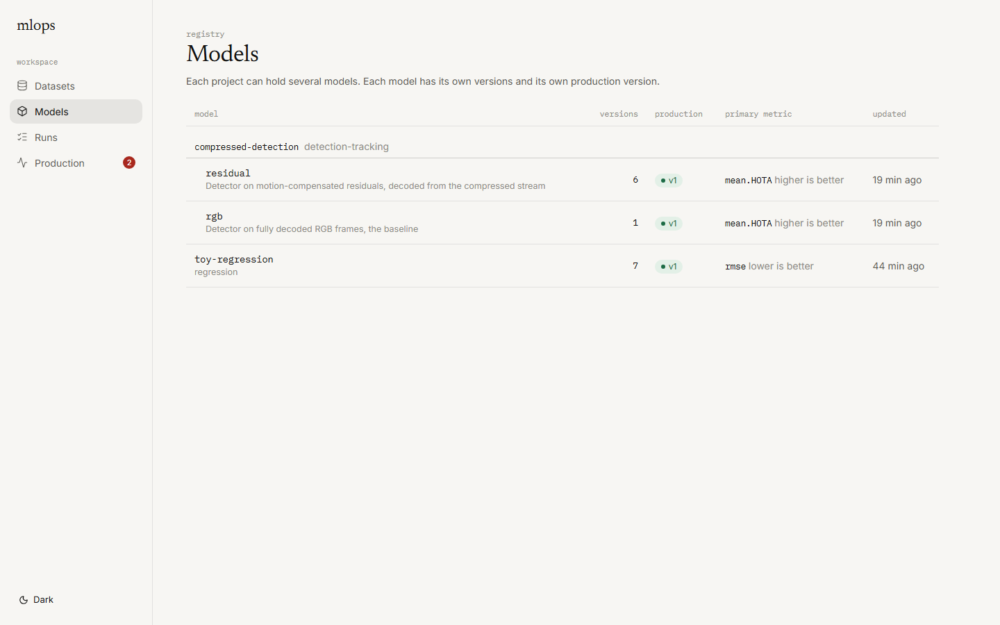
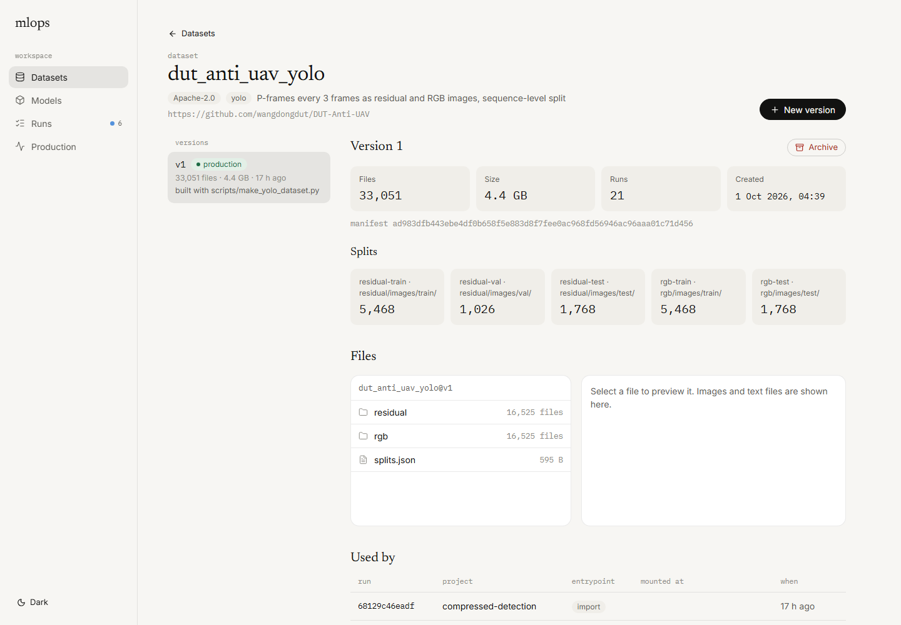
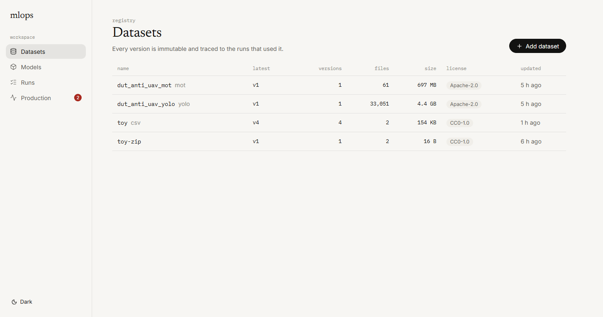

# mlops-platform

Model-agnostic MLOps platform for teams that train and ship their own models, down to edge hardware. A project plugs in with a `project.yaml` ([contract](docs/contract.md)); the platform runs its commands in Docker and reads the JSON they write. Scope and status of each module: [spec](docs/spec.md).

- **Datasets**: immutable versions stored once by content, splits, license, file browser with label overlay, diff between versions, lineage to every run and model.
- **Training**: queue trainings from the UI with config overrides, dataset versions and a hardware profile; live log and training curves; automatic evaluation and benchmarks of the new version.
- **Models**: several models per project, versions with their variant (architecture, export), import of existing weights, comparison on the same dataset version with 95 % intervals, confusion matrix with the scores computed from it, threshold curves and slices.
- **Promotion**: a configurable rule (gain on the primary metric, no regression on guarded metrics, edge constraints per hardware profile), forced promotions with a reason, rollback and full history.
- **Edge**: benchmarks under Docker CPU and memory limits (latency p50/p95/p99, per-stage time, RAM, size, GFLOPs), ONNX and INT8 exports as new versions, accuracy against latency per profile.
- **Production**: one container per model, redeployed on promotion, live latency, throughput, errors and confidence from Prometheus, drift without labels (PSI on input and prediction histograms), live view of the frame the model sees.

## Screenshots

Production service of a drone detector on a 2-CPU profile: live metrics, the last offline evaluation, drift without labels and the frame seen by the model.



| Model versions with variants, version details, edge benchmarks | Training run with live curves and automatic promotion |
| --- | --- |
|  |  |

| Runs | Models grouped by project |
| --- | --- |
|  |  |

| Dataset version, splits and lineage | Datasets |
| --- | --- |
|  |  |

## Start

```bash
docker compose up -d --build
python -m venv .venv
.venv/Scripts/python -m pip install -e .
cd ui && npm install && npm run build && cd ..
```

Then, in two terminals:

```bash
mlops api
```

```bash
mlops worker
```

| Service | URL |
| --- | --- |
| Platform UI | http://localhost:8000 |
| API docs | http://localhost:8000/api/docs |
| MLflow | http://localhost:5000 |
| Prometheus | http://localhost:9090 |
| PostgreSQL | localhost:5432 (`platform`, `mlflow`) |

PostgreSQL, MLflow and Prometheus run in Docker. The API and the worker run on the host: the API reads dataset folders and hard-links them into the store, the worker starts project containers. The worker is a separate process, so restarting the API never stops a running job. Credentials default to `mlops` / `mlops`, override them in `.env`. Services listen on localhost only.

## Plug in a project

```bash
docker build -t mlops-toy-regression:cpu examples/toy-regression
mlops validate examples/toy-regression
mlops dataset add toy data/raw/toy_v1 --license CC0-1.0 --split train=train --split test=test
mlops run examples/toy-regression train --dataset toy@v1
mlops run examples/toy-regression evaluate --model toy-regression@candidate --dataset toy@v1
mlops model promote toy-regression 1
mlops serve start toy-regression
```

`examples/toy-regression` is a minimal project in plain Python; `load.py` sends test traffic to its service. Anything a project writes to the run given in `MLFLOW_RUN_ID` (per-epoch metrics for example) shows up as live curves.

`mlops project archive toy-regression` stops its services and hides it from the platform without deleting anything; `mlops project restore` brings it back. Datasets versions are archived the same way from the UI.

## CLI

| Command | Purpose |
| --- | --- |
| `mlops run <project> <entrypoint>` | Run an entrypoint with `--dataset name@vN`, `--model project.model@vN`, `--slot`, `--config`, `--profile`, `--variant`, `--set key=value` |
| `mlops dataset add / list / show / diff / verify` | Dataset versions |
| `mlops model list / import / promote / rollback / history / rename` | Model registry |
| `mlops serve start / stop / status / logs` | Production services |
| `mlops api`, `mlops worker` | Platform API and UI, job worker |

Dataset files are stored once by content hash in `store/`. By default they are hard-linked from the source folder, which makes the source files read-only; `--copy` keeps them editable at the cost of disk space. Files matching `dataset_ignore` in `configs/platform.yaml` are skipped.

Each run is an MLflow run in the experiment named after the project: params (command, config values, profile), tags (image id, Git commit), metrics from the JSON outputs, artifacts (model, metrics, config, stdout, hardware). Platform settings are in `configs/platform.yaml`, hardware profiles in `configs/hardware_profiles.yaml`. Docker-limited profiles approximate a target and their results are marked estimated.

## Tests

```bash
.venv/Scripts/python -m pip install -e ".[dev]"
.venv/Scripts/python -m pytest
```

On Windows, stop `mlops api` and `mlops worker` before reinstalling: pip cannot replace `mlops.exe` while it runs.

## UI development

```bash
cd ui
npm run dev
```

Serves the UI on http://localhost:3000 with `/api` proxied to `mlops api`.
